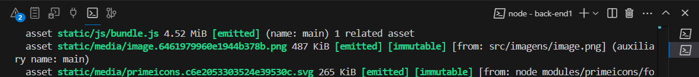

<h1 align="center">:computer: Trabalho de LPIII :computer:</h1>

<h3 align="center">:beers: Projeto: Encomenda de Cervejas Artesanais :beers:</h3>

**Linguagem de Programação III – Pedro Henrique Gonçalves Mota**

### Entidades e Relacionamentos

- **Usuário**
  - Criador (proponente)
  - Empório (interessado)
- **Relacionamentos**
  - Criador [1:n] CervejaArtesanal
  - Empório [1:n] Encomenda
  - Encomenda : Empório - CervejaArtesanal

## Rodar o projeto

### Pré-requisitos

- Node.js instalado (v22)
- Yarn instalado

### Instalando o nvm no Windows - facilita mudar de versão do node caso tenha outra versão na máquina

Para instalar o nvm no Windows, siga os passos abaixo:

1. Baixe o instalador do nvm para Windows a partir do [repositório oficial](https://github.com/coreybutler/nvm-windows/releases).
2. Execute o instalador e siga as instruções na tela.
3. Após a instalação, abra um novo terminal e execute o comando abaixo para verificar se o nvm foi instalado corretamente:

   ```sh
   nvm version
   ```

### Instalando o Node.js v22

Para instalar a versão 22 do Node.js, execute o seguinte comando:

```sh
nvm install 22
```

Para usar a versão 22 do Node.js, execute:

```sh
nvm use 22
```

### Instalando o Yarn globalmente

Para instalar o Yarn globalmente, execute o seguinte comando:

```sh
npm install -g yarn
```

### Dica: para abrir o terminal no VS Code: `Ctrl + "`

Clicando no `+`, é possível usar mais de um terminal ao mesmo tempo, facilitando a navegação entre os diretórios e a execução dos comandos.



### Passos

1. Abra os dois diretórios do projeto e instale as dependências:

   ```sh
   cd /c:/LPIII/front-end1
   ```

   ```sh
   cd /c:/LPIII/back-end1
   ```

2. Instale as dependências do projeto (em cada diretório, um por vez):

   ```sh
   yarn install
   ```

3. Execute o comando para iniciar a aplicação web (esteja no diretório do backend):

   ```sh
   yarn web
   ```

4. Abra o navegador e acesse:

   ```sh
   http://localhost:3000
   ```
